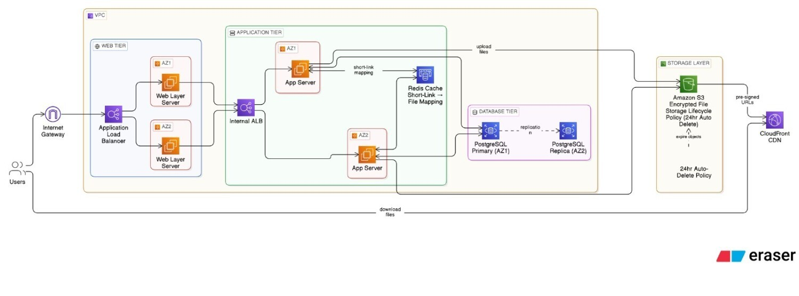

# CloudDrop — Secure Ephemeral File Sharing

CloudDrop is a modern, high-performance ephemeral file-sharing platform. It allows users to securely upload, encrypt (in-browser), and share files with automatic self-destruction policies. Built with a sleek, premium neon-dark aesthetic, CloudDrop provides a seamless user experience while ensuring enterprise-grade security and scalable cloud architecture.




## 🚀 Features

- **Ephemeral Storage**: Fully automated 24-hour self-destruct lifecycle policies ensure data does not persist longer than needed.
- **High-Performance Architecture**: Built on a multi-tier AWS infrastructure designed for high availability and low latency.
- **Secure Short Links**: Redis-backed short links map temporary aliases to encrypted storage blobs securely.

## 🏗️ System Architecture

CloudDrop is deployed in a highly available multi-tier AWS environment:

1. **Edge & Web Tier**
   - **Users** access the application via a **CloudFront CDN**, which caches static assets and securely routes traffic.
   - Traffic enters the **VPC** via an **Internet Gateway** and hits the **Application Load Balancer (ALB)**.
   - The ALB distributes requests across the **Web Layer Servers** deployed across multiple Availability Zones (AZ1 & AZ2).

2. **Application Tier**
   - The Web Layer forwards API requests through an **Internal ALB** to the **App Servers** (FastAPI backend).
   - App Servers interact with a **Redis Cache** to instantly resolve short-link mappings to file metadata without hitting the database for every request.

3. **Database Tier**
   - A highly available **PostgreSQL** database (Primary in AZ1, Replica in AZ2) stores persistent metadata, user session states, and audit logs.

4. **Storage Layer**
   - Files are uploaded directly to an **Amazon S3** bucket featuring a strict 24-hour Auto-Delete lifecycle policy.
   - Download requests retrieve pre-signed URLs from S3, which are served securely back to the user via the CloudFront CDN.

## 🛠️ Tech Stack

- **Backend**: Python 3.11, FastAPI, Uvicorn
- **Frontend**: Vanilla HTML5, CSS3, JavaScript (No heavy frameworks)
- **Infrastructure**: AWS (EC2, S3, ALB, CloudFront, Redis/ElastiCache, RDS PostgreSQL, Systems Manager)
- **Encryption**: AES-GCM 256-bit

## 💻 Local Development Setup

1. **Clone the repository**
   ```bash
   git clone https://github.com/yourusername/clouddrop.git
   cd clouddrop
   ```

2. **Create a virtual environment**
   ```bash
   python -m venv venv
   source venv/bin/activate  # On Windows use `venv\Scripts\activate`
   ```

3. **Install dependencies**
   ```bash
   cd backend
   pip install -r requirements.txt
   ```

4. **Environment Variables**
   Create a `.env` file in the backend directory based on your AWS configuration:
   ```env
   REDIS_HOST=localhost
   REDIS_PORT=6379
   S3_BUCKET_NAME=your-dev-bucket
   AWS_REGION=us-east-1
   # Add your database credentials if running locally
   ```

5. **Run the Application**
   ```bash
   uvicorn main:app --reload --port 8000
   ```
   Access the app at `http://localhost:8000`.

## 📦 Deployment

Deployment is fully automated using AWS Systems Manager (SSM). When changes are made, the backend is compressed and pushed to S3, followed by an SSM Run Command trigger that automatically unzips and restarts the `clouddrop` systemd service across the EC2 fleet. 

See `aws_deployment_guide.md` and `deploy_userdata.sh` for detailed infrastructure setup instructions.

## 📄 License

This project is licensed under the MIT License.
